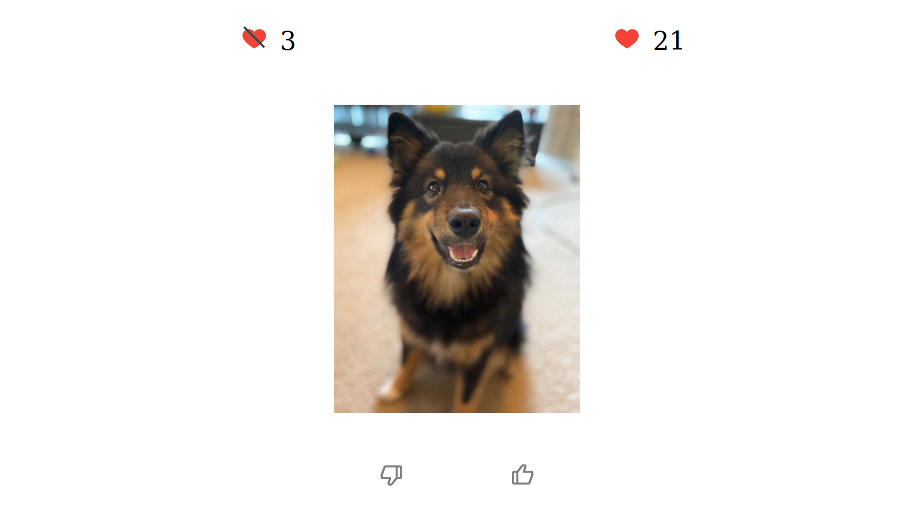

# match-finding

A simple interactive app for preferring pictures of dogs made to practice the React Redux library.

## :technologist: Languages

- React
- JavaScript
- CSS
- HTML

## :package: Dependencies

- react-redux
- redux-thunk
- redux-devtools-extension
- react-icons
- axios

## :rocket: Contributing

Requested APIs from:

- [Dog API](https://dog.ceo/dog-api/)

## :beers: Recognition 

A great thanks for Appleseeds bootcamp!
